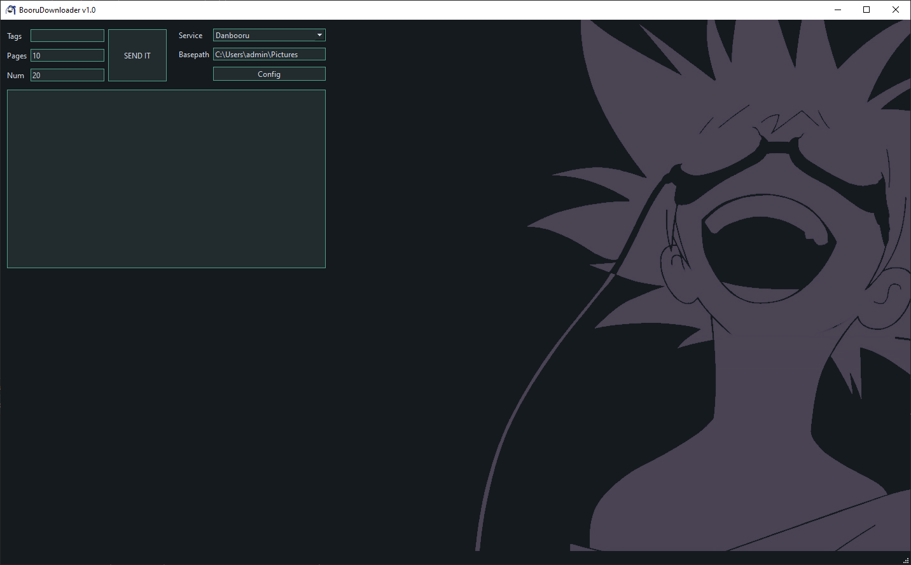
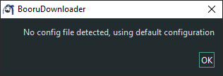
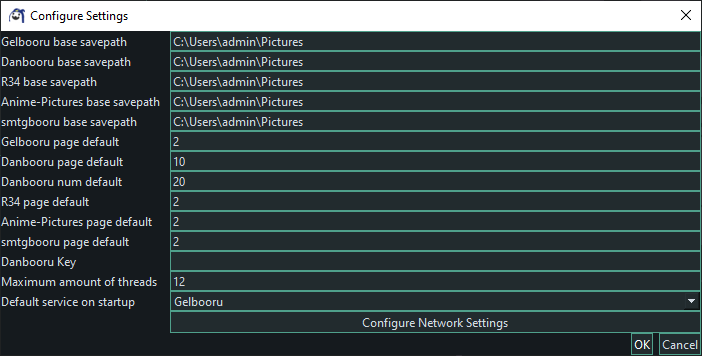
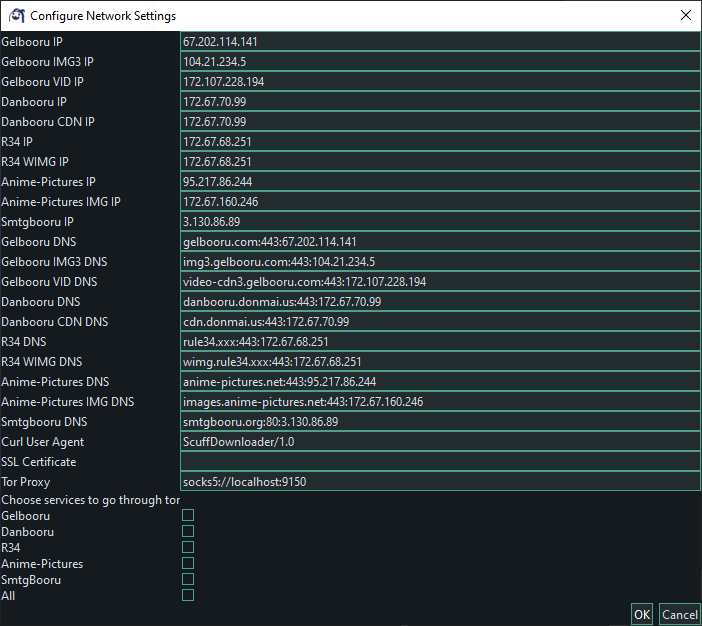

# BooruDownloader

## Features

Small program made to make using various booru sites more comfortable  
Downloads images/gifs/videos and saves to disk from
- Danbooru
- Gelbooru
- R34
- Anime-Pictures
- smtgbooru  

Search is done the exact same way it would be done on the sites

## Usage  
### Downloading
  

This will
- search danbooru for the tags "fate_(series)"  
- attempt to grab 1 page with 5 results per page
- attempt to create the folder C:\Users\admin\Pictures\fate_(series)
- download the 5 grabbed results and save them to the aforementioned folder

It is important that the path described in Basepath is valid, as I did not  
implement nested folder creation logic to deal with this

### Config

Config files are loaded from C:\Users\\[user]\AppData\Local\ScuffDownloader\config.scuff

If this folder does not exist the program will create it  
If this file does not exist the program will launch with default parameters  
defined in globals.h

The configuration window is pretty self-explanatory, with some outliers  

The Danbooru Key slot should be populated with your danbooru api key if you have one  
If you do not have one the program will still work, though you will be limited to 2 tags at any one time

Thread count is used to limit multiprocessing as to not overload apis  

The network settings menu is also mostly fine to leave default, with some outliers  

The Curl User Agent should be changed to something original so as to not immediately get sniffed out as a bot

! IMPORTANT !  
The program requires an ssl cert bundle to run. Place the path to the .crt in the SSL Certificate field  
or the program will not function

The Tor Proxy field is by default set to the default socks5 proxy the tor browser spins up automatically  

The program will check whether or not the tor connection is secure before starting the initial request,  
however it will assume the connection is fine so long as the initial check succeeded  
Checking for every download would be a lot of checks, slowing down an already greatly slowed process  

If you disagree with this philosophy and want greater peace of mind, you can place a call to  
checkTorConnection in the curlDownloadToStringBufferTor and curlDownloadToFilePointerTor functions
and check their return value